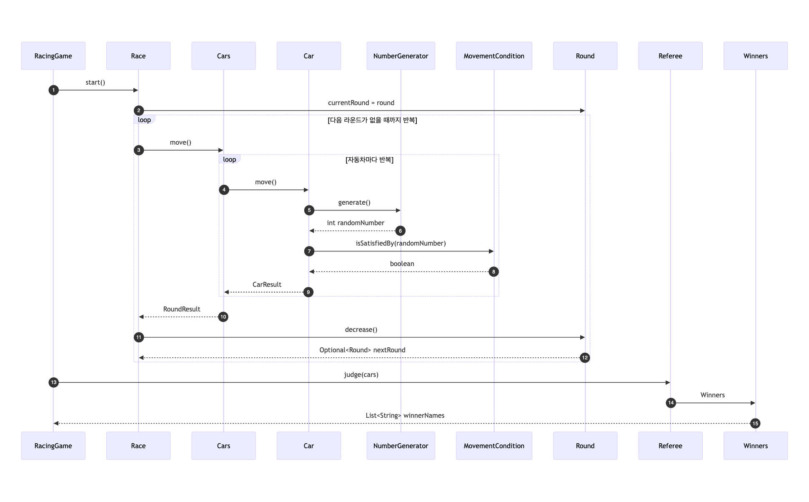

# java-racingcar-precourse

## ▶️️ 흐름

1. 자동차 이름들을 입력한다(자동차는 구분자로 구분한다).
2. 시도 횟수를 입력한다.
3. 이동 조건 및 전략에 따라 라운드마다 자동차를 이동시킨다.
4. 라운드마다 이동 결과를 출력한다.
5. 모든 라운드가 종료시 우승자를 판단한다.
6. 우승자를 출력한다.
   

---

## 📝️ 기능 목록

### ▪️ 입력 기능

- [x] 자동차 이름 입력 받기
    - [x] 공백일 경우 예외를 반환한다.
- [x] 시도 횟수 입력 받기
    - [x] 공백일 경우 예외를 반환한다.

### ▪️ 보조 기능

- [x] 구분자를 기준으로 파싱하기
- [x] 정수형으로 파싱하기
    - [x] 정수가 아닌 경우 예외를 반환한다.

### ▪️ 비지니스 기능

- 자동차를 등록한다.
    - 이름
        - 조건 미충족 시 예외를 반환한다.
        - [x] 이름은 `최소 1자 ~ 최대 5자`까지 허용한다.
        - [x] 빈문자열은 허용하지 않는다.
        - [x] 이름은 `영어와 한글`만 허용한다.
        - [x] 중복은 허용하지 않는다.
    - 등록 가능 개수
        - 조건 미충족 시 예외를 반환한다.
        - [x] 자동차는 `최소 2대 ~ 최대 10대`까지 허용한다.

- 시도 횟수를 등록한다.
    - 조건 미충족 시 예외를 반환한다.
    - [x] `최소 1번 ~ 최대 25번`까지 허용한다.

- [x] 등록한 시도 횟수만큼 반복한다.
    - 자동차를 움직인다.
        - [x] 전진 조건 판단을 위한 숫자를 생성한다.
        - [x] 자동차의 전진조건을 판단한다.
        - [x] 조건 만족 시 자동차를 움직인다.
    - 자동차 이동 기록을 기록한다.
        - [x] 각 라운드별 이동 결과를 저장한다.
    - 시도 횟수를 차감한다.
        - [x] 시도 횟수가 남았는지 확인한다.

- 우승자를 판단한다.
    - [x] 가장 멀리 이동한 자동차를 찾는다.
    - [x] 같은 위치에 존재하는 자동차들을 찾는다.

### ▪️ 출력 기능

- [x] 실행 결과 출력
- [x] 우승자 출력
    - 여러 명일 경우 구분자로 구분

---

## 📌 실행 결과 예시

```text
경주할 자동차 이름을 입력하세요.(이름은 쉼표(,) 기준으로 구분)
aa,ee,ll
시도할 횟수는 몇 회인가요?
3

실행 결과
aa : 
ee : -
ll : 

aa : -
ee : --
ll : 

aa : --
ee : ---
ll : -

최종 우승자 : ee
```

---

## 📦 패키지 구조

| Package                | Class                      | Description                 |
|:-----------------------|:---------------------------|:----------------------------|
| ▶️ **root**            | `Application`              | 프로그램의 진입점 (Main 클래스)        |
|                        | `RacingGame`               | 자동차 경주 게임 실행을 담당하는 핵심 클래스   |
| 💾 **domain**          | `Cars`                     | 경주에 참여하는 자동차들의 집합을 관리하는 클래스 |
|                        | `Race`                     | 전체 레이스를 진행하는 클래스            |
|                        | `Referee`                  | 레이스의 우승자를 판정하는 클래스          |
|                        | `Round`                    | 한 번의 시도(라운드)를 표현하는 클래스      |
|                        | `Car`                      | 자동차의 이동 로직 및 상태를 관리하는 클래스   |
|                        | `Name`                     | 자동차의 이름을 표현하고 검증하는 클래스      |
|                        | `MovementCondition`        | 자동차의 이동 조건을 정의하는 인터페이스      |
|                        | `ForwordMovementCondition` | 자동차의 전진 조건을 정의하는 구현 클래스     |
| 📦 **dto**             | `CarResult`                | 한 라운드에서 각 자동차의 결과를 저장       |
|                        | `RoundResult`              | 라운드별 결과를 저장                 |
|                        | `RaceHistory`              | 전체 레이스의 라운드 결과를 누적 저장       |
|                        | `Winners`                  | 최종 우승자 목록을 관리               |
| 🚨 **exception**       | `ExceptionMessage`         | 예외 상황 메시지를 관리               |
| 🔢 **numbergenerator** | `NumberGenerator`          | 난수 생성 전략을 정의하는 인터페이스        |
|                        | `RandomNumberGenerator`    | 랜덤 값을 반환하는 구현 클래스           |
| 🧩 **util**            | `Parser`                   | 문자열 입력을 파싱하여 필요한 형태로 변환     |
| 💬 **view**            | `InputView`                | 사용자 입력(이름, 시도 횟수)을 처리       |
|                        | `OutputView`               | 경주 결과 및 우승자 출력              |

---

## 💡 구현 시 고민했던 부분들

### 1. 값 객체(Value Object)는 언제 활용해야 좋을까?

기능을 구현하면서 `Round`와 `Position`을 값 객체로 만들어야 할지 고민이 있었습니다.
객체를 생성함으로써, 값이 무엇을 의미하는지 명확하게 드러내고 캡슐화를 통해 응집도를 높일 수 있기 때문입니다.

`Round`는 게임의 진행 단계를 표현하는 값이었습니다.
“마지막 라운드인지 판단한다.”, “라운드의 값은 범위 내에 존재해야 한다.” 같은 규칙이 존재했고,
이 규칙이 도메인의 의미를 강화한다고 느꼈습니다.
그래서 `Round`를 값 객체로 분리했습니다.
그 결과, 라운드라는 개념이 코드상에서도 명확히 드러나고, 규칙이 한곳에 응집되어 코드의 의도가 훨씬 선명해졌습니다.

반면 `position`은 같은 패턴을 따를 필요가 있을까 고민이 됐습니다.
처음엔 일관성을 위해 `Position`을 값 객체로 만드는 게 자연스러워 보였지만, 실제로는 그 필요성이 명확하지 않았습니다.
현재 position은 단순히 “자동차가 이동한 거리"를 나타내는 상태 값입니다.
이 값은 `Car` 내부에서 자동차의 행위 결과로써 존재할 뿐, 독립적인 규칙이나 의미가 있는 별도의 개념 객체는 아닙니다.
캡슐화를 위해 값 객체로 감싸는 게 좋을까? 고민했지만,
이미 `Car`가 position을 완전히 내부에서 제어하고 있어 추가적인 캡슐화 이득이 없다고 판단했습니다.
오히려 불필요한 객체가 늘어나 코드만 복잡해질 수 있다고 생각하여 position을 값 객체로 만들지 않았습니다.

이번 고민을 통해 모든 값을 값 객체로 만드는 것이 꼭 좋은 선택은 아니라는 걸 느꼈고,
값 객체를 도입할 때는 불변성 자체보다, 의미 전달과 책임의 명확성이 기준이 되어야 한다는 걸 배웠습니다.

### 2. 랜덤한 값에 의존하는 전진 조건, 어떻게 테스트 가능하게 만들까?

자동차가 전진할지는 무작위로 생성된 숫자에 따라 결정됩니다.
하지만, 이 무작위 값 때문에 테스트 코드에서는 예상할 수 있는 결과를 얻기 어려웠습니다.
실행할 때마다 값이 달라지다 보니, 어떤 경우엔 통과하고 어떤 경우엔 실패하는 등 결과가 일관되지 않았고,
이로 인해 의미 있는 테스트 코드를 작성하기 어려웠습니다.

이 문제를 해결하기 위해 `NumberGenerator` 인터페이스를 분리했습니다.
숫자를 생성 로직을 추상화하여 프로그램 실행 시에는 무작위로 생성된 숫자 반환,
테스트 시에는 예측 가능한 숫자를 반환하는 구현체로 대체할 수 있게 했습니다.
이렇게 하니 요구사항인 랜덤성 자체는 유지하면서도, 테스트에서는 원하는 결과를 제어할 수 있었습니다.

이번 설계를 통해 인터페이스가 주는 확장성을 체감했습니다.
조건을 바꾸고 싶을 때마다 if문을 추가하거나 기존 코드를 수정할 필요 없이,
새로운 구현체를 만들어 주입하는 것만으로도 다양한 상황을 쉽게 추가할 수 있었기 때문입니다.
이를 통해 확장성을 고려할 때 인터페이스를 적극적으로 활용할 수 있음을 배웠습니다.

### 3. 정적 멤버 객체는 언제 사용하는 것이 좋을까?

제가 생각하는 도메인은 프로그램의 핵심 비즈니스 규칙과 개념을 표현하는 영역입니다.
즉, 기획 의도나 요구사항이 바뀌면 함께 수정되어야 하는 부분이 도메인 로직이라고 생각합니다.
1주 차에는 이 기준이 명확하지 않아, 하나의 클래스에 유틸성 로직과 도메인 로직이 뒤섞인 상태였습니다.
비즈니스 규칙을 검증하는 로직과 단순히 문자열을 파싱하는 기능이 같은 클래스 안에 존재했기 때문에
정적 멤버 객체로 만들 수 없었습니다.

하지만 코드 리뷰를 계기로 도메인 로직과 유틸 로직을 구분하는 명확한 기준을 세우게 되었습니다.
단순히 문자열을 파싱하거나 숫자를 변환하는 기능처럼,
비즈니스 규칙과 직접적인 연관이 없는 유틸성 로직들을 별도의 `Parser` 클래스로 분리했습니다.
이렇게 역할을 분리하니 `Parser`는 비즈니스 규칙과 직접적인 연관이 없고,
상태를 가지지 않으며, 여러 도메인에서 공통으로 활용될 수 있는 정적 멤버 객체의 조건을 충족하게 되었습니다.

이전에는 도메인이라는 말이 막연하게 들렸지만,
이제는 어떤 코드가 비즈니스 의미를 표현하고, 어떤 코드는 단지 동작을 돕는 유틸에 속하는지
스스로 판단할 수 있는 기준을 세우게 되어 뿌듯한 경험이었습니다.

### 4. 예외 메시지를 Enum으로 관리하면 무엇이 좋을까?

처음에는 기능에 대한 예외 처리를 할 때, 예외 메시지를 직접 문자열로 입력했습니다.
간단해 보였지만, 이 방식은 여러 문제를 만들었습니다.
우선 테스트 코드에서도 같은 메시지를 중복으로 작성해야 했습니다.
예외 메시지가 조금이라도 바뀌면, 테스트가 실패하기에 테스트 코드의 문자열 또한 수정해야 했습니다.
또한 예외 메시지를 여러 곳에서 직접 작성하다 보니 오타나 표현 불일치 등 일관성 문제가 쉽게 발생할 수 있었습니다.

이 문제를 해결하기 위해 `ExceptionMessage` enum을 도입했습니다.
예외 메시지를 한 곳에서 관리하고, 각 메시지를 상수로 정의했습니다.
그 결과 IDE 자동완성을 통해 오타를 방지할 수 있었고,
메시지가 변경되더라도 테스트 코드에는 영향을 주지 않아 유지보수성과 안정성이 크게 높아졌습니다.

기존에는 단순히 예외 메시지를 한 클래스에 모아두면 편하니까 enum을 쓰는 줄 알았습니다.
하지만 이번에 적용해 보며, 오타 방지와 유지보수를 위한 실질적인 이유가 있었다는 걸 알게 되었습니다.
작은 부분이지만, 이런 세세한 설계 포인트에도 신경 써야 한다는 걸 느꼈습니다.

### 5. Record로 DTO(Data Transfer Object)를 만들었는데, 왜 불변 컬렉션을 따로 감싸야 할까?

자동차 이동 결과에 대한 DTO를 만들 때 record를 사용했습니다.
이때 record는 모든 필드가 final로 선언되기 때문에, 컬렉션도 자연스럽게 불변일 거라 생각했습니다.

하지만 테스트 중에 리스트를 수정해 보니,
record의 필드가 final이더라도 내부 리스트의 원소는 변경 가능하다는 점을 알게 되었습니다.
참조는 고정되어 있지만, 리스트 자체는 여전히 가변이었습니다.
이 문제를 해결하기 위해 생성자 안에서`List.copyOf()`로 불변 컬렉션을 감싸주었습니다.

겉보기엔 사소한 차이였지만 final 키워드가 참조 변경만 막을 뿐,
내부 데이터의 변경까지 막지는 않는다는 점을 직접 확인했습니다.
따라서 진짜 불변 객체를 만들기 위해서는
내부 컬렉션을 외부에서 수정할 수 없도록 방어 복사를 적용해야 한다는 것을 배웠습니다.
